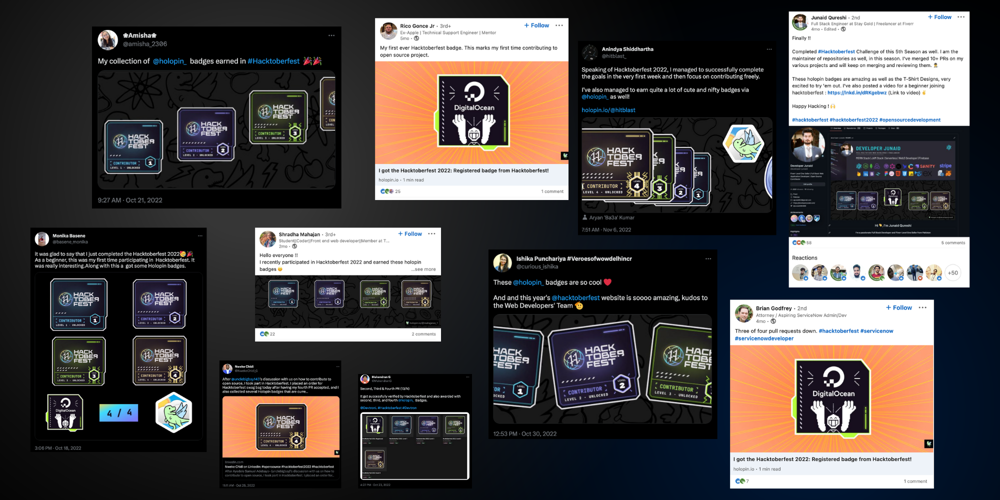

# Striver-AtoZ-Solution-HacktoberFest-2023

Welcome to the Striver-AtoZ-Solution-HacktoberFest-2023 repository!

## Motive
This repository is dedicated to organizing and merging solutions to Data Structure and Algorithm (DSA) questions from Striver's DSA sheet. The primary goal is to create a comprehensive and structured collection of DSA solutions that can serve as a valuable resource for learners and enthusiasts.

## Hacktoberfest 2023
[Hacktoberfest](https://hacktoberfest.digitalocean.com/) is an annual event that celebrates open source. During the month of October, developers from around the world are encouraged to contribute to open-source projects on GitHub. By participating in Hacktoberfest, you have the opportunity to make meaningful contributions to the open-source community and earn exciting rewards!


<br>



## How to Contribute
To contribute to this repository for Hacktoberfest 2023, follow these steps:
1. Fork this repository.
2. Clone your forked repository to your local machine.
3. Add your DSA solutions to the appropriate folders or categories.
4. Commit your changes and push them to your fork.
5. Create a pull request to merge your contributions into this repository.

Please ensure that your contributions adhere to the guidelines provided in the [CONTRIBUTING.md](CONTRIBUTING.md) file.

## Contribution Rules📚:

- You are allowed to make pull requests that break the rules. We just merge it ;)
- Do NOT add any build steps e.g npm install (we want to keep this a simple static site)
- Do NOT remove other content.
- Styling/code can be pretty, ugly or stupid, big or small as long as it works
<!-- - Add your name to the contributorsList file. -->
- Try to keep pull requests small to minimize merge conflicts


## Getting Started 🤩🤗:

- Fork this repo (button on top)
- Clone on your local machine

```terminal
git clone https://github.com/fineanmol/Hacktoberfest2022.git
```
- Navigate to project directory.
```terminal
cd Hacktoberfest2022
```

- Create a new Branch

```markdown
git checkout -b my-new-branch
```

<!--- - Add your Name to `contributors/contributorsList.js`. -->

```markdown
git add .
```
- Commit your changes.

```markdown
git commit -m "Relevant message"
```
- Then push 
```markdown
git push origin my-new-branch
```


- Create a new pull request from your forked repository

<br>


## Our Top Contributors 
<p align="center"><a href="https://github.com/PrinceSah09/Striver-AtoZ-Solution-HacktoberFest-2023/graphs/contributors">
  
</a></p>
